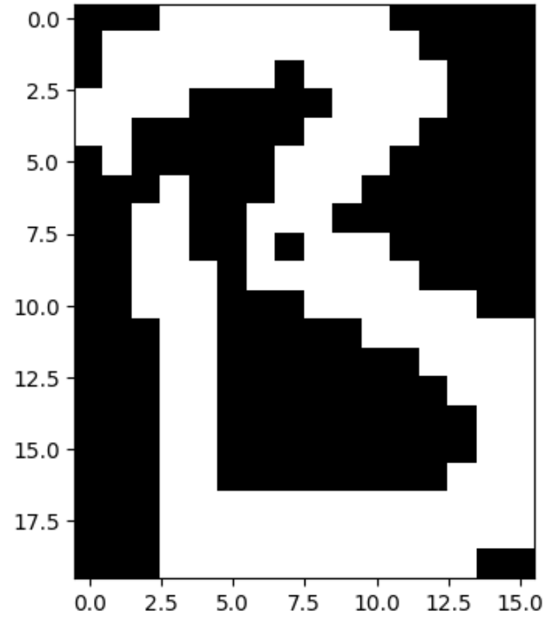
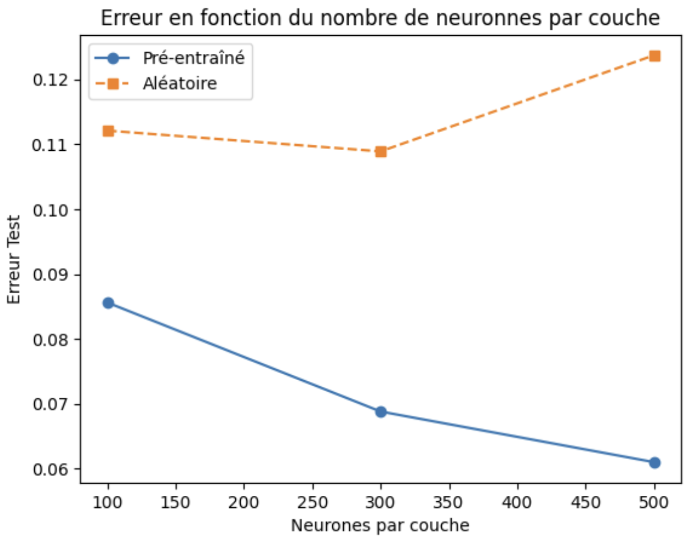

# Deep Belief Networks & Restricted Boltzmann Machines from Scratch

[](https://www.python.org/downloads/)
[](https://opensource.org/licenses/MIT)

A pure **NumPy** implementation of Restricted Boltzmann Machines (RBM) and Deep Belief Networks (DBN). This project investigates the foundational impact of **greedy layer-wise unsupervised pre-training** and its role as an effective weight initialization and regularization scheme before supervised backpropagation on deep neural networks (DNN).

---

## 1. Introduction

The objective of this work is to study the contribution of unsupervised pre-training in deep neural networks. We implement fundamental algorithms (RBM, DBN) from scratch to generate data, followed by a complete feedforward DNN for handwritten digit classification.

The benchmark systematically compares two approaches on the MNIST dataset:
- **Pre-trained Network**: Layer-by-layer unsupervised pre-training via DBN followed by supervised fine-tuning (backpropagation).
- **Randomly Initialized Network**: Standard weight initialization (Normal distribution) trained purely with supervised backpropagation.

---

## 2. Preliminary Study: Generative Models (Binary AlphaDigits)

In this first section, we validate our generative algorithms on the **Binary AlphaDigits** dataset ($20 \times 16$ binary images). The objective is not classification, but evaluating the model's capacity to reconstruct and synthesize learned patterns.

### 2.1 Restricted Boltzmann Machine (RBM)
The RBM is implemented from scratch and trained using the **Contrastive Divergence-1 (CD-1)** algorithm.

#### 2.1.1 Single-Character Generation ('A')
We trained the RBM exclusively on the character 'A' to evaluate its reconstruction and generation capabilities.

<p align="center">
  
</p>

#### 2.1.2 Multimodal Modeling Capacity (Multiple Characters)
We tested the RBM's ability to simultaneously learn multiple characters. The goal is to verify if the network captures a multimodal probability distribution and spontaneously sample across classes via **Gibbs Sampling**.

<p align="center">
  
</p>

> **Analysis**: The RBM successfully generates shapes resembling the learned characters. Gibbs sampling allows navigation through the state space: the network occasionally hesitates between letters (creating chimera artifacts), but predominantly converges toward stable energy basins matching the training data, validating its ability to model complex multimodal distributions.

#### 2.1.3 Convergence Analysis (Reconstruction Error)
To quantify learning efficiency, we monitored the Mean Squared Error (MSE) between input data and their reconstruction across training epochs.

<p align="center">
  
</p>

> **Convergence Dynamics**:
> - **Fast Learning Phase (Epochs 1–20)**: Error drops sharply, indicating the network quickly learns global topological structures.
> - **Stabilization Phase (Epochs 20–100)**: Error decreases asymptotically toward an asymptotic plateau (~0.02), reflecting detail refinement under gradient updates.

### 2.2 Deep Belief Network (DBN)
By stacking multiple RBMs using greedy layer-wise training, higher latent layers extract hierarchical, abstract representations. Images generated via deep DBN chains are cleaner and less noisy than those from a single RBM, as upper layers filter local high-frequency noise.

---

## 3. Supervised Classification: DNN on MNIST

We then focus on the **MNIST** classification benchmark ($28 \times 28$ digits 0–9). We compare identical feedforward DNN architectures initialized via DBN pre-training versus pure random initialization.
- **Hyperparameters**: 20 RBM epochs / 30 Backprop epochs, Learning Rate = 0.1, Batch Size = 64.

### 3.1 Criterion 1: Influence of Network Depth (Profondeur)
With layer width fixed at 200 hidden neurons, we varied depth from **2 to 4 hidden layers**.

<p align="center">
  
</p>

> **Analysis**: A critical depth-related phenomenon is observed:
> - **Random Initialization (Orange Curve)**: As depth increases (3 or 4 layers), test error explodes. Standard sigmoid backpropagation suffers severely from the **vanishing gradient problem**, where error signals attenuate across deep uninitialized layers.
> - **Pre-trained Network (Blue Curve)**: Error remains remarkably low and stable (~7%) even at 4 layers. DBN pre-training places weights inside an optimal basin of attraction, enabling effective gradient flow from the start of fine-tuning.

### 3.2 Criterion 2: Influence of Layer Width (Largeur)
With depth fixed at 2 hidden layers, we varied layer width from **100 to 500 neurons**.

<p align="center">
  
</p>

> **Analysis**: Expanding network width improves overall performance due to higher representational capacity. However, the pre-trained DBN network systematically maintains lower error rates than random initialization, confirming that DBN weights act as an effective regularizer.

### 3.3 Criterion 3: Influence of Training Dataset Size
With an architecture fixed at `[784, 200, 200, 10]`, we varied the training set size from **1,000 to 40,000 images**.

<p align="center">
  
</p>

> **Analysis**:
> - **Low-Data Regime ($N = 1,000$)**: The performance gap is massive. Unsupervised feature learning extracts structural priors from unlabeled data, helping overcome severe label scarcity.
> - **High-Data Regime ($N \ge 30,000$)**: Curves converge. With abundant labeled data, pure supervised backpropagation finds strong minima on its own, rendering pre-training less critical (though still beneficial for convergence speed).

---

## 4. Optimal Configuration & Results

- **Final Test Error (Pre-trained DBN)**: **~4.0% (96.0% Accuracy)**
- **Final Test Error (Random Init)**: ~8.0% (92.0% Accuracy)

### Output Probability Confidence
For test digits (e.g., a handwritten '7'), the pre-trained classifier yields sharply peaked probability distributions ($P(y=7) > 0.95$, near 0 elsewhere), with cross-entropy loss converging cleanly to ~0.08, proving high model certainty and discriminative power.

---

## 5. Conclusion

This project demonstrates two core principles:
1. **Generative Representation**: Unsupervised RBM and DBN models successfully learn underlying data distributions and synthesize realistic instances via Markov chain Gibbs sampling.
2. **Pre-training Advantage**: DBN initialization outperforms random initialization when networks are deep (mitigating vanishing gradients) or when labeled data is scarce.

---

## Project Structure

```text
+-- assets/            # Benchmark figures and evaluation curves
+-- data/              # Binary datasets (MNIST & AlphaDigits)
+-- notebooks/         # Complete Google Colab / Jupyter notebook
+-- src/
¦   +-- rbm.py         # Contrastive Divergence CD-1 implementation
¦   +-- dbn.py         # Deep Belief Network layer stacking
¦   +-- dnn.py         # Feedforward & Backpropagation fine-tuning
¦   +-- utils.py       # Data loaders & pre-processing routines
+-- main.py            # Model entrypoint
+-- requirements.txt
```

# Quickstart & Reproducibility
## 1. Installation
```text
Bash
git clone [https://github.com/LRitchie-data/deep-belief-networks-from-scratch.git](https://github.com/LRitchie-data/deep-belief-networks-from-scratch.git)
cd deep-belief-networks-from-scratch
pip install -r requirements.txt
```
## 2. Dataset Setup
Ensure the following binary files are placed in the working directory:

train-images-idx3-ubyte

train-labels-idx1-ubyte

t10k-images-idx3-ubyte

t10k-labels-idx1-ubyte

binaryalphadigs.mat

## 3. Run
Execute the pipeline via:
```text
Bash
python main.py
```
Or open and run the notebook notebooks/exploration_generative_alpha.ipynb.


# References
Hinton, G. E., Osindero, S., & Teh, Y. W. (2006). A fast learning algorithm for deep belief nets. Neural Computation, 18(7), 1527-1554.

Bengio, Y., et al. (2007). Greedy layer-wise training of deep networks. NeurIPS.
'@
